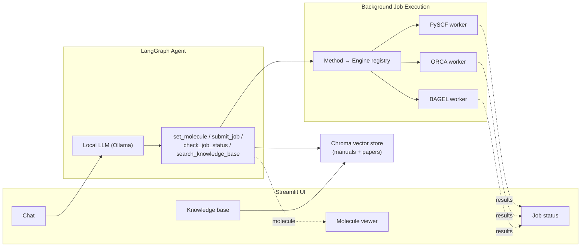

# Computational Chemistry Agent

A conversational, WebMO-style assistant for quantum chemistry — talk to it in plain English, it runs the calculation.

Name a molecule, describe a calculation, and the agent resolves the structure, fills in a proper input file for the right quantum chemistry engine, runs it in the background, and reports back with real numbers — energies, frequencies, excitation spectra, orbitals — pulled straight from the engine's own output, not guessed by the LLM.

Everything runs locally: a local LLM via [Ollama](https://ollama.com), and three real quantum chemistry engines — [PySCF](https://pyscf.org), [ORCA](https://www.faccts.de/orca/), [BAGEL](https://nubakery.org) — on your own hardware.

## What it does

- **Molecule input by name or SMILES.** Ask for "caffeine" or paste a SMILES string; the agent resolves it via PubChem/OPSIN, generates a 3D structure with numbered atoms, and shows it immediately — with an XYZ/Z-matrix coordinate view on request — no calculation needed just to look at a molecule.
- **Runs real jobs, not fabricated numbers.** Single-point energies, geometry optimization, vibrational frequencies, CASSCF, CASPT2, TD-DFT/TDA/CIS/TD-HF, EOM-CCSD, molecular orbital visualization, and potential energy scans — routed automatically to whichever of PySCF, ORCA, or BAGEL is right for the method (and reports plainly if none of them can do what you asked).
- **Shows you the input before running anything.** Every job pauses for your explicit approval on the exact input file it built — hand-edit the ORCA/BAGEL text yourself if you want, it gets sanity-checked before running either way.
- **Asks before it guesses.** Missing a basis set? An active space for a CASSCF calculation? The agent asks a specific, focused question instead of silently picking a value that would quietly produce wrong physics.
- **Never blocks the UI.** Jobs run as background subprocesses. Ask a follow-up, submit another job, or just wait — the agent tells you when results are ready and summarizes them itself.
- **Plots UV/Vis spectra from excited-state jobs**, and says clearly when a job has no oscillator strengths to plot rather than faking one.
- **Can write its own tools.** For a parser, plot, or QM-calculation helper with nothing pre-built for it, the agent can propose new Python code — you review and approve it (or reject it) before it's ever registered or run, same as a job's input.
- **Grounded in your own references.** Starts pre-seeded with the BAGEL and ORCA manuals plus a PySCF reference (see [Seeding the knowledge base](#seeding-the-knowledge-base-optional-recommended)); upload more software manuals or papers through the sidebar any time. The agent searches this local vector store to get exact input syntax right or pull in background on a molecular system.

## Screenshot

<p align="center">
  
</p>

## Architecture



Jobs are dispatched to isolated subprocesses and polled from disk, so a slow calculation (or an engine crash) never freezes the conversation. See [`CLAUDE.md`](CLAUDE.md) for the full architecture writeup — job execution model, LangGraph state design, and the non-obvious bugs that shaped it.

## Requirements

- A [Conda](https://docs.conda.io) environment with Python 3.11 and the packages in [`requirements.txt`](requirements.txt)
- [Ollama](https://ollama.com) running locally, with a tool-calling-capable model pulled (default: `qwen3:30b`) and an embedding model (default: `nomic-embed-text`)
- [PySCF](https://pyscf.org) (installed via `requirements.txt`) for the default engine
- Optionally, local installs of [ORCA](https://www.faccts.de/orca/) and [BAGEL](https://nubakery.org) for methods routed to those engines (CASPT2 requires BAGEL)

## Setup

```bash
conda create -n qc-agent python=3.11
conda activate qc-agent
pip install -r requirements.txt

ollama pull qwen3:30b
ollama pull nomic-embed-text
```

### Seeding the knowledge base (optional, recommended)

The agent's RAG knowledge base starts empty; you can seed it with the BAGEL and ORCA manuals plus a PySCF reference generated from your installed package, so it has baseline domain knowledge before you upload anything yourself:

```bash
PYTHONPATH=$PWD python3 scripts/seed_knowledge_base.py
```

This crawls the [BAGEL](https://nubakery.org/user-manual.html) and [ORCA](https://orca-manual.mpi-muelheim.mpg.de/) manuals (both permit it — neither publishes a `robots.txt` restriction) and generates PySCF reference docs from the docstrings of your actually-installed `pyscf` package rather than scraping pyscf.org, whose `robots.txt` explicitly disallows AI crawlers including `ClaudeBot`. Takes a few minutes; safe to re-run. Run a single stage with e.g. `python3 scripts/seed_knowledge_base.py orca`.

## Running

```bash
conda activate qc-agent
export PYTHONPATH=$PWD
streamlit run app/main.py
```

Open the URL Streamlit prints (default `http://localhost:8501`). Try:

- `water` — resolves and visualizes the structure
- `run a single point HF/STO-3G calculation on water` — submits a background job
- `run a CASSCF calculation on formaldehyde` — the agent will ask for the basis set and active space
- `show me the HOMO and LUMO of water at HF/STO-3G` — renders orbital isosurfaces once the job finishes

## Configuration

Every setting lives in [`app/config.py`](app/config.py) and is overridable via environment variables:

| Variable | Default | Purpose |
|---|---|---|
| `QC_AGENT_LLM_MODEL` | `qwen3:30b` | Ollama model for the agent |
| `QC_AGENT_LLM_BASE_URL` | `http://localhost:11434/v1` | Ollama's OpenAI-compatible endpoint |
| `QC_AGENT_EMBEDDING_MODEL` | `nomic-embed-text` | Embedding model for the RAG store |
| `QC_AGENT_ORCA_BIN` | `/opt/Orca-6.1.1/orca` | Path to the ORCA executable |
| `QC_AGENT_BAGEL_BIN` | `/opt/bagel-1.2.2/bin/BAGEL` | Path to the BAGEL executable |
| `QC_AGENT_N_CORES` | auto-detected via `nproc` | Cores available for parallel jobs |
| `QC_AGENT_MAX_CONCURRENT_JOBS` | `4` | Background job concurrency cap |

## Known limitations

- The `pes_scan` job type's two-endpoint mode interpolates in Cartesian coordinates, not true internal-coordinate LIIC — fine for similar endpoint geometries, not rigorous for large structural changes. Single-coordinate scans (bond/angle/dihedral) are proper internal-coordinate manipulation.
- No cap on knowledge-base upload size or job-artifact retention; monitor disk usage on long-running deployments.

## Project layout

```
app/
  agent/       LangGraph agent: state, tools, prompts, graph, dynamic (agent-created) tools
  chemistry/
    jobs/      Job manager + PySCF/ORCA/BAGEL runners and worker subprocesses
    molecule.py, viz.py, zmatrix.py, spectrum.py
  rag/         Chroma-backed knowledge base: store, ingestion, query tool
  ui/          Streamlit rendering components
  config.py    All configuration, env-var overridable
  main.py      Streamlit entry point
scripts/
  seed_knowledge_base.py   Crawl BAGEL/ORCA manuals + generate PySCF reference docs, ingest into RAG
data/          Runtime data (jobs, molecules, kb, uploads, scraped, dynamic_tools) -- gitignored
```
