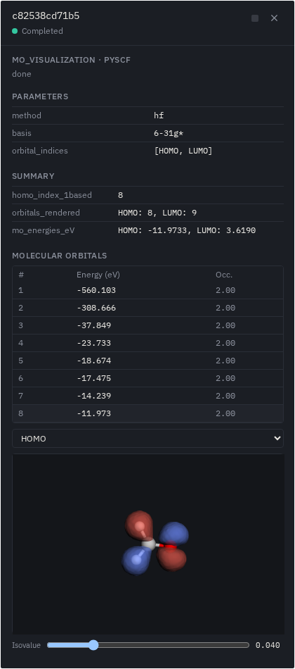
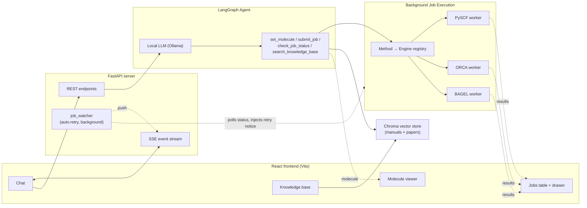

# QM Calculation Agent

A conversational, WebMO-style assistant for quantum chemistry — talk to it in plain English, it runs the calculation.

Name a molecule, describe a calculation, and the agent resolves the structure, fills in a proper input file for the right quantum chemistry engine, runs it in the background, and reports back with real numbers — energies, frequencies, excitation spectra, orbitals — pulled straight from the engine's own output, not guessed by the LLM.

Everything runs locally: a local LLM via [Ollama](https://ollama.com), and three real quantum chemistry engines — [PySCF](https://pyscf.org), [ORCA](https://www.faccts.de/orca/), [BAGEL](https://nubakery.org) — on your own hardware.

## What it does

- **Molecule input by name, SMILES, or pasted XYZ/xmol coordinates.** Ask for "caffeine", paste a SMILES string, or paste a raw XYZ/xmol coordinate block straight into the chat; the agent resolves it (via PubChem/OPSIN for names, directly for coordinates), generates a 3D structure with numbered atoms, and shows it immediately — with an XYZ coordinate view on request, an enlarge button for a bigger view, and a reset button to clear it — no calculation needed just to look at a molecule.
- **Runs real jobs, not fabricated numbers.** Single-point energies, geometry optimization, vibrational frequencies, CASSCF, CASPT2, TD-DFT/TDA/CIS/TD-HF, EOM-CCSD, molecular orbital visualization, and potential energy scans — routed automatically to whichever of PySCF, ORCA, or BAGEL is right for the method (and reports plainly if none of them can do what you asked).
- **Shows you the input before running anything.** Every job pauses for your explicit approval on the exact input file it built — hand-edit the ORCA/BAGEL text yourself if you want, it gets sanity-checked before running either way.
- **Asks before it guesses.** Missing a basis set? An active space for a CASSCF calculation? The agent asks a specific, focused question instead of silently picking a value that would quietly produce wrong physics.
- **Never blocks the UI.** Jobs run as background subprocesses. Chat, job status, and results all update live over a real-time stream — ask a follow-up, submit another job, or just wait. If the model gets stuck (e.g. looping on a malformed tool call), hit Stop to interrupt the turn and get the composer back immediately, rather than waiting it out.
- **Job manager, not just a status line.** Every job you've submitted shows up in a live table (status, engine, description), with a kill button for anything still running and a detail drawer for full parameters, results, and artifacts once it finishes — including a download button (a ZIP of the job's files for ORCA/BAGEL, a generated text summary for PySCF, which has no literal input/output file), a geometry flyout (the optimized structure for a geometry optimization, the input structure otherwise), and a raw-output flyout for ORCA/BAGEL jobs.
- **Conversations title themselves.** A fresh conversation auto-renames from your first message once the agent responds — you're never left scrolling a sidebar full of "New conversation".
- **Auto-retries failed jobs.** A failed job triggers an automatic investigate-and-retry cycle (check the error, consult the knowledge base, search the web if needed) — but a retry never runs without your explicit approval on the corrected input, and the retry budget is enforced by code, not by trusting the model to count its own attempts.
- **Plots UV/Vis spectra from excited-state jobs**, and says clearly when a job has no oscillator strengths to plot rather than faking one.
- **Molecular orbitals, click to inspect any of them — no need to ask for it upfront.** Every completed single-point, TD-DFT/EOM-CCSD, CASSCF, or CASPT2 job carries its own per-orbital energy/occupancy table automatically; click any row to render that orbital as a real 3D isosurface on demand, with an isovalue slider. Works uniformly across all three engines (PySCF directly, ORCA via its own `orca_plot` utility, BAGEL via a molden export) even though each gets there through a different pipeline under the hood, and CASSCF/CASPT2 orbitals show genuine natural-orbital occupation numbers (fractional in the active space), not integer HF-style occupancies.
- **Animates vibrational modes**, not just a frequency table — click a mode in a completed frequency job and watch the actual displacement (PySCF jobs only for now; see [Known limitations](#known-limitations)).
- **Can write its own tools.** For a parser, plot, or QM-calculation helper with nothing pre-built for it, the agent can propose new Python code — you review and approve it (or reject it) before it's ever registered or run, same as a job's input.
- **Grounded in your own references.** Starts pre-seeded with the BAGEL and ORCA manuals plus a PySCF reference (see [Seeding the knowledge base](#seeding-the-knowledge-base-optional-recommended)); add more through the sidebar any time — drag and drop one or several PDF/TXT/MD/DOCX files at once (with a live upload-progress indicator), paste a web page URL to scrape and ingest it directly, or drop a paper card straight out of chat — each searchable inline with a click-to-preview flyout (native PDF/HTML/text rendering) for any source, sorted most-recently-added first. The agent also automatically consults this store when building job input, to get exact keyword syntax right rather than relying on the model's own memory.
- **Built-in help.** A help button in the sidebar opens a flyout explaining the UI and giving a plain-language primer on every supported job type.

## Screenshots

<p align="center">
  
</p>

Chat on the left drives everything — here the agent has resolved formaldehyde, generated a DFT input, and paused for approval before running it. The right-hand instrument panel shows the live 3D structure and every job across every conversation, not just the current one.

<p align="center">
  
</p>

Click-to-inspect molecular orbitals: any row in the energy/occupancy table renders its orbital on demand (formaldehyde's HOMO, an oxygen lone pair, shown here).

## Architecture

The app is a React single-page app talking to a FastAPI backend, which wraps the same LangGraph agent, job manager, and RAG store as before — none of that changed, only the presentation layer and the API surface in front of it.



Jobs are dispatched to isolated subprocesses and polled from disk, so a slow calculation (or an engine crash) never freezes the conversation — and never shares a lock with the agent's own LLM calls, so job status stays live even mid-turn. See [`CLAUDE.md`](CLAUDE.md) for the full architecture writeup: job execution model, LangGraph state design, the SSE/streaming design, and the non-obvious bugs that shaped all of it.

## Requirements

- A [Conda](https://docs.conda.io) environment with Python 3.11 and the packages in [`requirements.txt`](requirements.txt), including `fastapi`, `uvicorn`, and `psutil` for the server
- **Node.js 18+ and npm**, for the frontend — the system Node on some distros is far too old for Vite; a dedicated conda env works well: `conda create -n node20 -c conda-forge nodejs=20`
- [Ollama](https://ollama.com) running locally, with a tool-calling-capable model pulled (default: `qwen3:30b`) and an embedding model (default: `nomic-embed-text`)
- [PySCF](https://pyscf.org) (installed via `requirements.txt`) for the default engine
- Optionally, local installs of [ORCA](https://www.faccts.de/orca/) and [BAGEL](https://nubakery.org) for methods routed to those engines (CASPT2 requires BAGEL)

## Setup

```bash
conda create -n qc-agent python=3.11
conda activate qc-agent
pip install -r requirements.txt

ollama pull qwen3:30b
ollama pull nomic-embed-text
```

```bash
conda create -n node20 -c conda-forge nodejs=20
conda activate node20
cd frontend && npm install
```

### Seeding the knowledge base (optional, recommended)

The agent's RAG knowledge base starts empty; you can seed it with the BAGEL and ORCA manuals plus a PySCF reference generated from your installed package, so it has baseline domain knowledge before you upload anything yourself:

```bash
conda activate qc-agent
PYTHONPATH=$PWD python3 scripts/seed_knowledge_base.py
```

This crawls the [BAGEL](https://nubakery.org/user-manual.html) and [ORCA](https://orca-manual.mpi-muelheim.mpg.de/) manuals (both permit it — neither publishes a `robots.txt` restriction) and generates PySCF reference docs from the docstrings of your actually-installed `pyscf` package rather than scraping pyscf.org, whose `robots.txt` explicitly disallows AI crawlers including `ClaudeBot`. Takes a few minutes; safe to re-run. Run a single stage with e.g. `python3 scripts/seed_knowledge_base.py orca`.

## Running

Two processes: the FastAPI backend and the Vite dev server for the frontend.

```bash
# Terminal 1 -- backend (binds to localhost only; this is a single-user, local-only app)
conda activate qc-agent
PYTHONPATH=$PWD python3 -m server.main

# Terminal 2 -- frontend
conda activate node20
cd frontend && npm run dev
```

Open the URL Vite prints (default `http://localhost:5173`). The dev server proxies `/api/*` to the backend on port 8000, so no CORS setup is needed for local use. Try:

- `water` — resolves and visualizes the structure
- `run a single point HF/STO-3G calculation on water` — submits a background job; approve it on the card that appears inline in the chat
- `run a CASSCF calculation on formaldehyde` — the agent will ask for the basis set and active space
- Deliberately submit a job with a bad parameter (e.g. an invalid basis string) and watch the agent auto-investigate and propose a corrected retry, still gated on your approval

## Configuration

Every setting lives in [`app/config.py`](app/config.py) and is overridable via environment variables:

| Variable | Default | Purpose |
|---|---|---|
| `QC_AGENT_LLM_MODEL` | `qwen3:30b` | Ollama model for the agent |
| `QC_AGENT_LLM_BASE_URL` | `http://localhost:11434/v1` | Ollama's OpenAI-compatible endpoint |
| `QC_AGENT_EMBEDDING_MODEL` | `nomic-embed-text` | Embedding model for the RAG store |
| `QC_AGENT_ORCA_BIN` | `/opt/Orca-6.1.1/orca` | Path to the ORCA executable |
| `QC_AGENT_BAGEL_BIN` | `/opt/bagel-1.2.2/bin/BAGEL` | Path to the BAGEL executable |
| `QC_AGENT_N_CORES` | auto-detected via `nproc` | Cores a single job requests (MPI ranks / OpenMP threads) |
| `QC_AGENT_MAX_CONCURRENT_JOBS` | `4` | Background job count cap |
| `QC_AGENT_MAX_CPU_PERCENT` | `80` | Soft admission gate: hold new jobs back once the *host's* average CPU (across all its cores) is at or above this |
| `QC_AGENT_MAX_MEM_PERCENT` | `80` | Soft admission gate: hold new jobs back once the host is this full on memory |
| `QC_AGENT_CORE_IDLE_THRESHOLD_PERCENT` | `20` | Soft admission gate: a job also waits until at least `N_CORES` individual host cores are each under this busy % |
| `QC_AGENT_SERVER_CORS_ORIGINS` | `http://localhost:5173,http://127.0.0.1:5173` | Allowed browser origins for the FastAPI server |

## Known limitations

- The `pes_scan` job type's two-endpoint mode interpolates in Cartesian coordinates, not true internal-coordinate LIIC — fine for similar endpoint geometries, not rigorous for large structural changes. Single-coordinate scans (bond/angle/dihedral) are proper internal-coordinate manipulation.
- No cap on knowledge-base upload size or job-artifact retention; monitor disk usage on long-running deployments.
- The molecule viewer is read-only (renders the structure with numbered atom labels) — no click-to-select bond/angle/dihedral measurement, which was dropped after surfacing more trouble than it was worth (see `CLAUDE.md`).
- Vibrational-mode animation only works for PySCF frequency jobs. ORCA and BAGEL frequency jobs still show the frequency table, but their mode-displacement vectors aren't parsed, so those rows aren't click-to-animate.
- Molecular-orbital cube rendering follows a different pipeline per engine (see `CLAUDE.md`'s architecture notes): PySCF renders directly from its own MO coefficients, BAGEL via a real molden export verified by point-sampling to match PySCF's own basis evaluation exactly, and ORCA via its own `orca_plot` utility rather than a molden export, after the latter was found to apply a shell-dependent AO normalization mismatch that distorts orbital shapes.
- No automated test suite; changes are verified by driving the running app with Playwright (see `CLAUDE.md`) and by direct runner-function invocation for the Python backend.

## Project layout

```
app/
  agent/       LangGraph agent: state, tools, prompts, graph, dynamic (agent-created) tools,
               threads.py (conversation registry), job_watcher.py (background auto-retry), serialize.py
  chemistry/
    jobs/      Job manager + PySCF/ORCA/BAGEL runners and worker subprocesses
    molecule.py, zmatrix.py, spectrum.py
  rag/         Chroma-backed knowledge base: store, ingestion, query tool
  config.py    All configuration, env-var overridable
server/        FastAPI backend for the React frontend: REST routes, SSE event hub, schemas
frontend/      Vite + React + TypeScript SPA -- chat, jobs table, molecule viewer, KB/tools panels
scripts/
  seed_knowledge_base.py   Crawl BAGEL/ORCA manuals + generate PySCF reference docs, ingest into RAG
data/          Runtime data (jobs, molecules, kb, uploads, scraped, dynamic_tools, threads.json) -- gitignored
```
