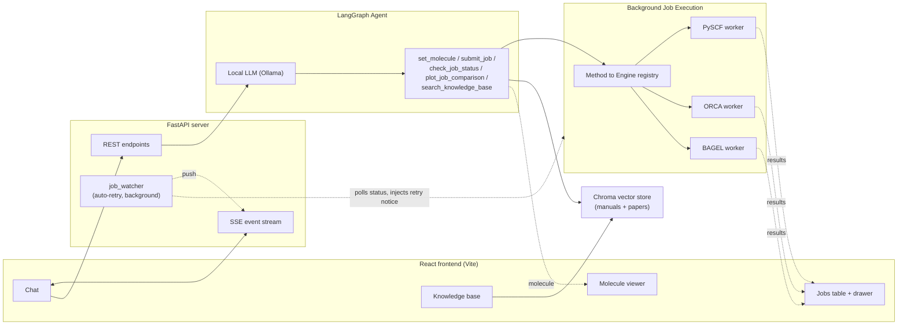

# QM Calculation Agent

A conversational, WebMO-style assistant for quantum chemistry — talk to it in plain English, it runs the calculation.

Name a molecule, describe a calculation, and the agent resolves the structure, fills in a proper input file for the right quantum chemistry engine, runs it in the background, and reports back with real numbers — energies, frequencies, excitation spectra, orbitals — pulled straight from the engine's own output, not guessed by the LLM.

Everything runs locally: a local LLM via [Ollama](https://ollama.com), and three real quantum chemistry engines — [PySCF](https://pyscf.org), [ORCA](https://www.faccts.de/orca/), [BAGEL](https://nubakery.org) — on your own hardware.

## Contents

- [What it does](#what-it-does)
- [Screenshots](#screenshots)
- [Architecture](#architecture)
- [Requirements](#requirements)
- [Setup](#setup)
- [Running](#running)
- [Configuration](#configuration)
- [Known limitations](#known-limitations)
- [Project layout](#project-layout)

## What it does

### Supported calculations

Every job type routes automatically to whichever engine actually supports it (the **bold** engine is the default; the agent explains plainly if you ask for something none of the three can do).

| Calculation | Engines | Notes |
|---|---|---|
| Single-point energy | **PySCF**, ORCA | HF or DFT |
| Geometry optimization | **PySCF**, ORCA | HF or DFT |
| Vibrational frequencies | **PySCF**, ORCA, BAGEL | BAGEL is HF-only and uses a slower numerical Hessian |
| CASSCF | **PySCF**, BAGEL, ORCA | ORCA is the only one that computes oscillator strengths |
| CASPT2 | **BAGEL** only | ORCA has no CASPT2 (it has NEVPT2 instead) |
| TD-DFT / TDA-DFT / CIS / TD-HF | **PySCF**, ORCA | one job type covers all four, picked by method + TDA flag |
| EOM-CCSD | **ORCA**, PySCF | ORCA computes oscillator strengths; PySCF is energies-only |
| Potential energy scan | **PySCF**, ORCA, BAGEL | runs as parallel sub-jobs, one per image; any job type per image |
| NEB transition-state search | **ORCA** only | PySCF has no native NEB implementation |
| Molecular orbital visualization | **PySCF**, ORCA, BAGEL | automatic on any completed single-point/TD-DFT/EOM-CCSD/CASSCF/CASPT2 job — no separate submission needed |
| Custom raw ORCA/BAGEL input | ORCA, BAGEL | for anything with no dedicated job type here; no structured result parsing |

### Talking to it

- **Molecule input by name, SMILES, or pasted XYZ/xmol coordinates.** Ask for "caffeine", paste a SMILES string, or paste a raw coordinate block; the agent resolves it (via PubChem/OPSIN for names, directly for coordinates) and shows a 3D structure with numbered atoms immediately — no calculation needed just to look at a molecule.
- **Asks before it guesses.** Missing a basis set? An active space for CASSCF? The agent asks a specific, focused question instead of silently picking a value that would quietly produce wrong physics.
- **Shows you the input before running anything.** Every job pauses for your explicit approval on the exact input file it built — hand-edit the ORCA/BAGEL text yourself if you want, it gets sanity-checked before running either way.
- **Never blocks the UI.** Jobs run as background subprocesses; chat, job status, and results all update live over a real-time stream. If the model gets stuck (e.g. looping on a malformed tool call), hit Stop to interrupt the turn and get the composer back immediately.

### Beyond the built-in job types

- **NEB transition-state searches, on the ground state or an excited state.** Give the agent a reactant and product structure and it runs ORCA's native NEB-TS path search between them — always asking first whether to pre-optimize the two endpoints, since that has no sensible default. The job's detail view shows a frame-by-frame slider over the converged path (the refined TS structure as its own frame), a reaction-path energy plot, and per-frame molecular orbitals.
- **Raw ORCA/BAGEL input for anything without its own job type** (an IRC path, a relaxed surface scan, etc.) — ask the agent to run it and it composes the complete literal input file itself, submitted through the same approval-card pipeline as any other job. The detail view shows the input geometry and raw output, plus a full-job download.
- **Can also write (but not run) an input for other QM software.** Ask for a Gaussian/NWChem/Psi4/etc. input and the agent composes the text directly in its reply — grounded in a manual you've uploaded, if any — but there's no approval card and no job, since this app has no way to execute anything outside PySCF/ORCA/BAGEL.
- **Potential energy scans run as real parallel jobs, not one slow sequential loop.** Give the agent a start and end geometry and it builds an interpolated path (IDPP by default, or true internal-coordinate LIIC, or plain Cartesian) and spawns one real sub-job per image — any job type, including a curve per electronic state for TD-DFT/CASSCF/CASPT2/EOM-CCSD — run concurrently under the same resource-aware job manager as everything else. Single-molecule bond/angle/dihedral scans use the same machinery.

### Job management

- **A job manager, not just a status line.** Every job shows up in a live table (status, engine, description) with a kill button and a detail drawer for full parameters, results, and artifacts — including a download button, a geometry flyout, and a raw-output flyout with a real find bar (Ctrl+F, match count, next/prev, highlighting).
- **Conversations title themselves — and you can pin or rename them.** A fresh conversation auto-renames from your first message once the agent responds. Pin the ones you'll come back to, rename any with the pencil icon or a double-click.
- **Auto-retries failed jobs.** A failed job triggers an automatic investigate-and-retry cycle (check the error, consult the knowledge base, search the web if needed) — but a retry never runs without your explicit approval on the corrected input, and the retry budget is enforced by code, not by trusting the model to count its own attempts.

### Results, visualized

- **Plots UV/Vis and IR spectra from completed jobs**, and says clearly when a job has no oscillator strengths/IR intensities to plot rather than faking one (IR intensities are ORCA/BAGEL only).
- **Names the orbitals behind each excited state.** Every TD-DFT/CIS/EOM-CCSD/CASSCF/CASPT2 job's excited-state table shows the leading orbital-pair excitation(s) for each state — read directly from the engine's own CI-vector or amplitude output, not inferred by the LLM.
- **Molecular orbitals, click to inspect any of them.** Every completed single-point/TD-DFT/EOM-CCSD/CASSCF/CASPT2 job carries a per-orbital energy/occupancy table automatically; click any row to render it as a real 3D isosurface, with an isovalue slider. Works uniformly across all three engines despite each getting there through a different pipeline, and CASSCF/CASPT2 orbitals show genuine fractional natural-orbital occupations, not integer HF-style ones.
- **Animates vibrational modes**, not just a frequency table — click a mode in a completed frequency job (any engine) and watch the actual displacement.
- **Compares results across jobs with a plot and a table.** Attach two or more completed jobs from the Job Manager panel and ask the agent to plot or compare a result (energy, HOMO-LUMO gap, etc.) — a bar chart appears directly in the chat with a download button, alongside a table of the underlying values.

### Knowledge base & help

- **Grounded in your own references.** Starts pre-seeded with the BAGEL and ORCA manuals plus a PySCF reference (see [Seeding the knowledge base](#seeding-the-knowledge-base-optional-recommended)); add more any time — drag and drop PDF/TXT/MD/DOCX files, paste a URL to scrape, or drop a paper card straight out of chat. The agent automatically consults this store when building job input, to get exact keyword syntax right.
- **Built-in help.** A help button in the sidebar opens a flyout explaining the UI and giving a plain-language primer on every supported job type.

## Screenshots

<p align="center">
  
</p>

Chat on the left drives everything — here the agent has resolved formaldehyde, generated a DFT input, and paused for approval before running it. The right-hand instrument panel shows the live 3D structure and every job across every conversation, not just the current one.

<p align="center">
  
</p>

Click-to-inspect molecular orbitals: any row in the energy/occupancy table renders its orbital on demand (formaldehyde's HOMO, an oxygen lone pair, shown here).

## Architecture

The app is a React single-page app talking to a FastAPI backend, which wraps a LangGraph agent, a background job manager, and a RAG knowledge-base store.



Jobs are dispatched to isolated subprocesses and polled from disk, so a slow calculation (or an engine crash) never freezes the conversation — and never shares a lock with the agent's own LLM calls, so job status stays live even mid-turn. The agent's own tool set is fixed (see the table above and `app/agent/tools.py`'s `STATIC_TOOLS`) — there is no mechanism for it to write or register new tools at runtime. See [`CLAUDE.md`](CLAUDE.md) for the full architecture writeup: job execution model, LangGraph state design, the SSE/streaming design, and the non-obvious bugs that shaped all of it.

## Requirements

| Requirement | Notes |
|---|---|
| [Conda](https://docs.conda.io) env, Python 3.11 | Packages from [`requirements.txt`](requirements.txt), including `fastapi`, `uvicorn`, `psutil` |
| Node.js 18+ and npm | For the frontend — system Node is often too old for Vite; a dedicated conda env works well: `conda create -n node20 -c conda-forge nodejs=20` |
| [Ollama](https://ollama.com), running locally | A tool-calling-capable model (default `qwen3:30b`) and an embedding model (default `nomic-embed-text`) |
| [PySCF](https://pyscf.org) | Installed via `requirements.txt`; the default engine, always available |
| [ORCA](https://www.faccts.de/orca/) *(optional)* | For methods routed to it — see the [calculation table](#supported-calculations) |
| [BAGEL](https://nubakery.org) *(optional)* | Required for CASPT2; also used for some CASSCF/frequency/scan paths |

## Setup

```bash
conda create -n qc-agent python=3.11
conda activate qc-agent
pip install -r requirements.txt

ollama pull qwen3:30b
ollama pull nomic-embed-text
```

```bash
conda create -n node20 -c conda-forge nodejs=20
conda activate node20
cd frontend && npm install
```

### Seeding the knowledge base (optional, recommended)

The agent's RAG knowledge base starts empty; you can seed it with the BAGEL and ORCA manuals plus a PySCF reference generated from your installed package, so it has baseline domain knowledge before you upload anything yourself:

```bash
conda activate qc-agent
PYTHONPATH=$PWD python3 scripts/seed_knowledge_base.py
```

This crawls the [BAGEL](https://nubakery.org/user-manual.html) and [ORCA](https://orca-manual.mpi-muelheim.mpg.de/) manuals (both permit it — neither publishes a `robots.txt` restriction) and generates PySCF reference docs from the docstrings of your actually-installed `pyscf` package rather than scraping pyscf.org, whose `robots.txt` explicitly disallows AI crawlers including `ClaudeBot`. Takes a few minutes; safe to re-run. Run a single stage with e.g. `python3 scripts/seed_knowledge_base.py orca`.

## Running

Two processes: the FastAPI backend and the Vite dev server for the frontend.

```bash
# Terminal 1 -- backend (binds to localhost only; this is a single-user, local-only app)
conda activate qc-agent
PYTHONPATH=$PWD python3 -m server.main

# Terminal 2 -- frontend
conda activate node20
cd frontend && npm run dev
```

Open the URL Vite prints (default `http://localhost:5173`). The dev server proxies `/api/*` to the backend on port 8000, so no CORS setup is needed for local use. Try:

| Say this | To see |
|---|---|
| `water` | Structure resolution and the 3D viewer |
| `run a single point HF/STO-3G calculation on water` | A background job — approve it on the card that appears inline in the chat |
| `run a CASSCF calculation on formaldehyde` | The agent asking for the basis set and active space instead of guessing |
| a job with a deliberately bad parameter (e.g. an invalid basis string) | The agent auto-investigating and proposing a corrected retry, still gated on your approval |
| `plot the energies of these jobs`, after attaching two or more completed jobs | An inline bar-chart comparison plus a markdown table |

## Configuration

Every setting lives in [`app/config.py`](app/config.py) and is overridable via environment variables:

| Variable | Default | Purpose |
|---|---|---|
| `QC_AGENT_LLM_MODEL` | `qwen3:30b` | Ollama model for the agent |
| `QC_AGENT_LLM_BASE_URL` | `http://localhost:11434/v1` | Ollama's OpenAI-compatible endpoint |
| `QC_AGENT_EMBEDDING_MODEL` | `nomic-embed-text` | Embedding model for the RAG store |
| `QC_AGENT_OLLAMA_EMBEDDING_TIMEOUT` | `30` (seconds) | Timeout on embedding calls — bounds how long a stalled Ollama request can hold the agent's internal lock |
| `QC_AGENT_ORCA_BIN` | `/opt/Orca-6.1.1/orca` | Path to the ORCA executable |
| `QC_AGENT_BAGEL_BIN` | `/opt/bagel-1.2.2/bin/BAGEL` | Path to the BAGEL executable |
| `QC_AGENT_N_CORES` | auto-detected via `nproc` | Cores a single job requests (MPI ranks / OpenMP threads) |
| `QC_AGENT_MAX_CONCURRENT_JOBS` | `4` | Background job count cap |
| `QC_AGENT_MAX_CPU_PERCENT` | `80` | Soft admission gate: hold new jobs back once the *host's* average CPU (across all its cores) is at or above this |
| `QC_AGENT_MAX_MEM_PERCENT` | `80` | Soft admission gate: hold new jobs back once the host is this full on memory |
| `QC_AGENT_CORE_IDLE_THRESHOLD_PERCENT` | `20` | Soft admission gate: a job also waits until at least `N_CORES` individual host cores are each under this busy % |
| `QC_AGENT_WEB_SEARCH_TIMEOUT` | `10` (seconds) | Per-engine timeout for the `web_search` tool's DuckDuckGo calls |
| `QC_AGENT_SEMANTIC_SCHOLAR_API_KEY` | *(none)* | Optional free API key for more reliable `search_academic_literature` results |
| `QC_AGENT_SERVER_CORS_ORIGINS` | `http://localhost:5173,http://127.0.0.1:5173` | Allowed browser origins for the FastAPI server |

## Known limitations

- A PES scan's per-image sub-jobs all share one set of calculation parameters — hand-editing an ORCA/BAGEL approval-card input text only ever applies to the first image's own file, not the rest of the scan (parameter edits, as opposed to raw text edits, do propagate to every image).
- Storage is capped and self-evicting, oldest first: job artifacts at 100GB total (`app/chemistry/jobs/quota.py`, evicting only completed/failed/cancelled job directories) and knowledge-base storage at 10GB total (`app/rag/quota.py`, evicting only sources added through the live uploader/paste/URL flow, never the pre-seeded manuals). Both are enforced at write time, not on a schedule, so monitor disk usage anyway on a long-running deployment. Current usage against each cap is shown live in the UI next to the "Job manager (all jobs)" and "Knowledge base" panel headers.
- The molecule viewer is read-only (renders the structure with numbered atom labels) — no click-to-select bond/angle/dihedral measurement, which was dropped after surfacing more trouble than it was worth (see `CLAUDE.md`).
- IR spectrum plotting/intensities are ORCA and BAGEL only — PySCF's frequency job type computes frequencies and normal modes but no dipole-derivative/IR-intensity output in this app.
- `plot_job_comparison` only supports a fixed set of scalar comparison fields (energy, HOMO-LUMO gap, zero-point energy, enthalpy, Gibbs free energy, TS energy) — it can't plot a list-valued result (e.g. a full excitation spectrum) across jobs, and there's no way to compare an arbitrary user-described quantity; the agent's tool set is fixed, with no runtime code-writing mechanism.
- Molecular-orbital cube rendering follows a different pipeline per engine (see `CLAUDE.md`'s architecture notes): PySCF renders directly from its own MO coefficients, BAGEL via a real molden export verified by point-sampling to match PySCF's own basis evaluation exactly, and ORCA via its own `orca_plot` utility rather than a molden export, after the latter was found to apply a shell-dependent AO normalization mismatch that distorts orbital shapes.
- No automated test suite; changes are verified by driving the running app with Playwright (see `CLAUDE.md`) and by direct runner-function invocation for the Python backend.

## Project layout

```
app/
  agent/       LangGraph agent: state, tools, prompts, graph,
               threads.py (conversation registry), job_watcher.py (background auto-retry), serialize.py
  chemistry/
    jobs/      Job manager + PySCF/ORCA/BAGEL runners and worker subprocesses
    molecule.py, zmatrix.py, spectrum.py
  rag/         Chroma-backed knowledge base: store, ingestion, query tool
  config.py    All configuration, env-var overridable
server/        FastAPI backend for the React frontend: REST routes, SSE event hub, schemas
frontend/      Vite + React + TypeScript SPA -- chat, jobs table, molecule viewer, KB panel
scripts/
  seed_knowledge_base.py   Crawl BAGEL/ORCA manuals + generate PySCF reference docs, ingest into RAG
data/          Runtime data (jobs, molecules, kb, uploads, scraped, threads.json) -- gitignored
```
