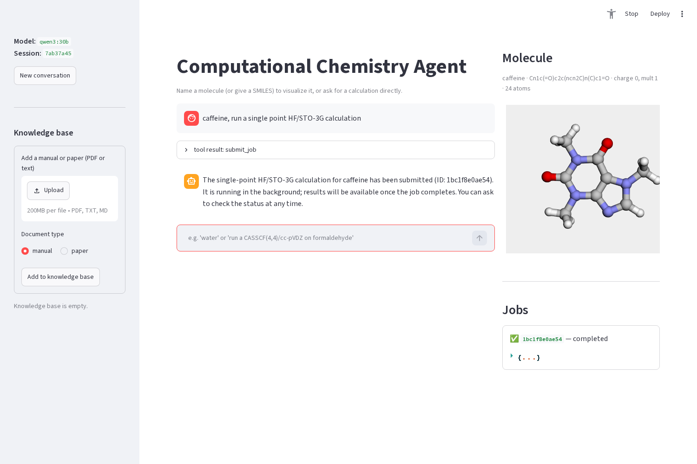
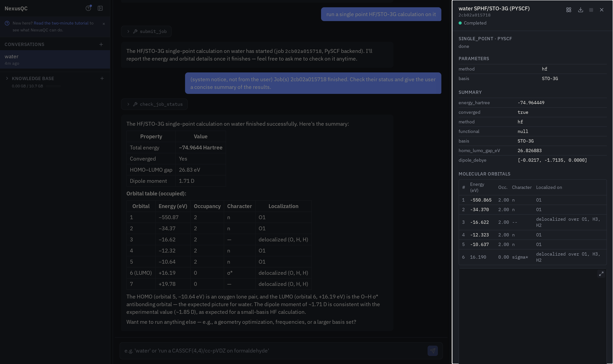
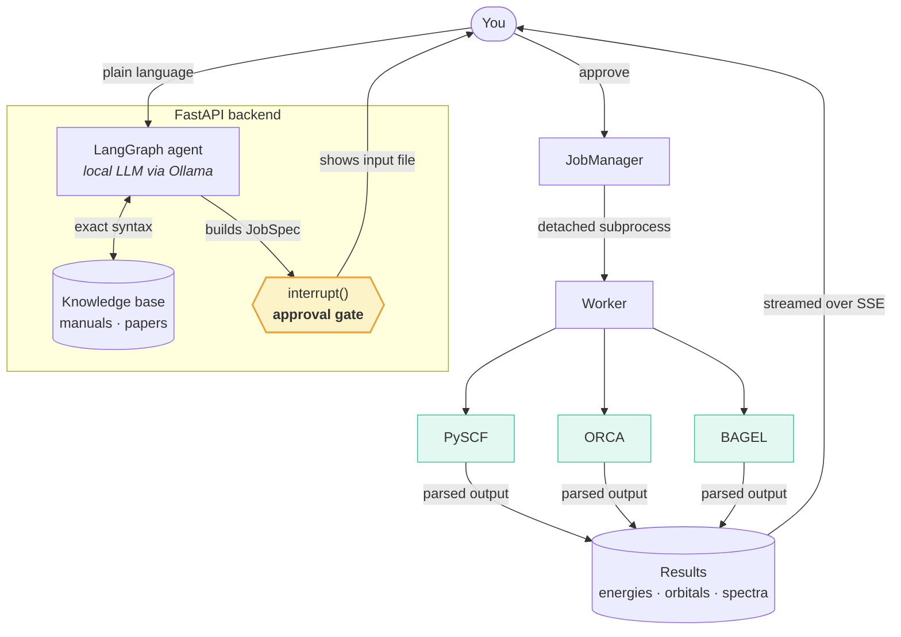

<div align="center">

# NexusQC

### Agentic Quantum Chemistry Engine

**Describe a calculation in plain English. Get real numbers from a real quantum chemistry program.**

[](LICENSE)
[](https://www.python.org)
[](https://nodejs.org)
[](#what-you-can-ask-for)
[](#install)



</div>

---

Name a molecule, say what you want to know, and NexusQC resolves the structure,
writes a proper input file for whichever program actually supports the method,
runs it in the background, and reports numbers parsed from that program's own
output. Not numbers a language model produced because they looked plausible.

Everything runs on your own hardware. The model is local, served through
[Ollama](https://ollama.com), and so are the engines:
[PySCF](https://pyscf.org), [ORCA](https://www.faccts.de/orca/) and
[BAGEL](https://nubakery.org).

Three things separate this from a chatbot with a calculator bolted on.

**Nothing runs without your approval.** Every job pauses on a real graph
interrupt and shows you the exact input file first. That's structural, not a
line in a prompt, so it holds even when the model never thinks to ask.

**It asks instead of guessing.** Missing a basis set or an active space? You
get a specific question back rather than a silently chosen default that
quietly produces the wrong physics.

**Failures get diagnosed, but only when you ask.** A failed job says so and
changes nothing on its own. Press *Troubleshoot* and the agent reads the
engine's actual output, checks the manual, searches the web if it has to, and
explains what went wrong. Any corrected job it proposes still goes through the
approval gate, because guessing at a fix can burn hours of compute you never
agreed to.

---

## What you can ask for

Ask in whatever words you'd use with a colleague. The table is what those words
resolve to, read directly from the app's capability registry.

**Columns are in routing order.** If you don't name a program, the leftmost one
in that row that supports your request is what runs.

| What you ask for | PySCF | ORCA | BAGEL |
|---|---|---|---|
| **Energies and properties** | | | |
| Ground-state energy | all six | all six | all three |
| Excited-state energies | HF, DFT, EOM-CCSD, CASSCF | HF, DFT, EOM-CCSD, CASSCF | CASSCF, CASPT2 |
| Energy gradient | HF, DFT, MP2, CCSD, CASSCF | HF, DFT, MP2, CASSCF | all three |
| Non-adiabatic coupling | CASSCF | HF, DFT | CASSCF, CASPT2 |
| **Structure** | | | |
| Geometry optimization | HF, DFT, MP2, CCSD, CASSCF | HF, DFT, MP2, CASSCF | all three |
| Constrained optimization | HF, DFT, MP2, CCSD, CASSCF | HF, DFT, MP2, CASSCF | — |
| Conical intersection | — | HF, DFT | CASSCF, CASPT2 |
| Transition state, by NEB | — | HF, DFT, MP2, CASSCF | — |
| **Vibrations** | | | |
| Frequencies | HF, DFT, CASSCF | HF, DFT, MP2, CASSCF | all three |
| Optimize, then frequencies | HF, DFT, CASSCF | HF, DFT, MP2, CASSCF | all three |
| **Scans, paths and ensembles** | | | |
| Scan a bond, angle or dihedral | all six | all six | — |
| Interpolate between two geometries | all six | all six | all three |
| Nuclear-ensemble UV/Vis spectrum | HF, DFT, EOM-CCSD, CASSCF | HF, DFT, EOM-CCSD, CASSCF | CASSCF, CASPT2 |
| Run the same job over a set of structures | all six | all six | all three |
| **Active space** | | | |
| Explain a proposed active space | CASSCF | — | — |
| Recommend one, autoCAS-style | CASSCF | — | — |
| Build one from valence character (AVAS) | CASSCF | — | — |
| **Escape hatch** | | | |
| Run your own input file, verbatim | — | all six | all three |

*All six* is HF, DFT, MP2, CCSD, EOM-CCSD and CASSCF. *All three* is HF, CASSCF
and CASPT2. The per-method evidence behind every cell, down to which ones were
executed here versus taken from a manual, is in
[QM_CAPABILITIES.md](docs/QM_CAPABILITIES.md).

A few things the table can't show. TDDFT, TDA-DFT, CIS and TD-HF are all the
excited-state row at HF or DFT with one flag toggled, not separate calculations
to choose between. Two requests override routing order regardless of what you
asked for: CASPT2 always goes to BAGEL, since ORCA has NEVPT2 instead and PySCF
has neither, and a CASSCF job that needs oscillator strengths always goes to
ORCA, the only one of the three that computes them. Orbital visualisation isn't
in the table because it isn't a calculation — every completed job already has
its orbitals in its own drawer.

Ask for something none of the three can do, a Gaussian or Psi4 calculation say,
and you'll get the input file written out in chat along with a plain statement
that it can't be run here.

### Building on work you've already done

Any CASSCF or CASPT2 job can start from a previous one's converged orbitals
instead of a fresh guess. Tag the source job and the new one restarts from it.
Same engine only, since orbital files don't convert between programs. On PySCF
this can cut macro-iterations noticeably when the two geometries are close; ORCA
and BAGEL use their own restart mechanisms, `MOREAD` and `load_ref`.

A new job can also run on a **previous job's geometry** rather than whatever is
in the molecule panel. "Run that again with a bigger basis" works, and so does
"same geometry as job X" — the agent already has the job id from the
conversation, so it never asks you for one. It takes the optimized geometry if
the job produced one, otherwise the input geometry. A job with no single
geometry of its own, like a scan or a Wigner ensemble, is refused by name rather
than guessed at.

---

## What comes back

**Orbitals on every completed job**, with per-orbital energies and occupancies.
Click a row for a 3D isosurface with an isovalue slider. CASSCF shows genuine
fractional natural-orbital occupations rather than integer HF-style ones.

**UV/Vis and IR spectra**, with the leading orbital-pair character named for
each excited state, read from the engine's own CI vectors rather than inferred.
Vibrational modes animate on all three engines. Nuclear-ensemble spectra pool
across every sampled geometry, with a per-state breakdown under the total curve;
the broadening-width slider re-renders as you drag it, because the transitions
are fetched once and re-broadened in the browser with no server round trip.

When a job genuinely has no oscillator strengths or IR intensities to plot, it
says so instead of drawing a flat line and pretending otherwise.

**Everything on screen downloads**, not just the job data. That includes a PNG
of a 3D viewer in its *current* state — the angle you rotated to, the isovalue
you picked, the frame you're on — and a vibrational mode as an animated PNG.
Files are named after the job, so a downloads folder reads as
`20260817_water_Freq_HF_sto-3g_ORCA_78a32a61_mode3_3840cm-1.png` rather than a
column of hex ids, and renaming a job carries through to its downloads.

**Every text viewer has a find bar with typo tolerance.** Raw input and output,
knowledge-base manuals, uploaded geometries — all open into the same viewer.
Ctrl/Cmd+F focuses its search box without leaving the page, matches are counted
and highlighted, and a query that's close but not exact still finds the word.

<div align="center">

<br>
<sub><i>A finished HF/STO-3G run on water. Every number is parsed from PySCF's own output, orbital characters and localisations included.</i></sub>
</div>

### Getting a molecule in

By name, SMILES, pasted XYZ, or a sketch — resolved through PubChem and OPSIN,
then shown in 3D with numbered atoms. You don't have to run a calculation just
to look at something.

Or upload it. Drop an `.xyz` on the composer and one geometry becomes the active
molecule, two become a start/end pair for an interpolated path or NEB, and three
or more become a taggable set you can pull individual frames from later. ORCA
and BAGEL input files upload the same way; the content lands in the chat itself,
so "run this verbatim" fills a blind job's input from what you attached with
nothing to retype.

Basis sets and functionals are matched against the names each engine really
recognises, so a typo gets you a short menu instead of a guess. If nothing in
the menu is right, its last entry searches
[Basis Set Exchange](https://www.basissetexchange.org/) for the published set —
bundled offline, not a network call — and confirms it covers every element in
your molecule before offering it. Per-engine translation is handled for you.

### Choosing a CASSCF active space

Picking an active space by hand is one of the more error-prone judgement calls
in multireference chemistry. Too small and you miss the physics; too large and
it's intractable.

NexusQC automates the first half using the idea behind
[autoCAS](https://doi.org/10.1021/acs.jctc.6b00722). It seeds a candidate space
from valence orbital character with
[AVAS](https://doi.org/10.1021/acs.jctc.7b00347), computes single-orbital
entropies over a deliberately cheap unconverged pilot, sweeps for the stable
plateau that marks a chemically meaningful cutoff, then runs a fully converged
state-averaged CASSCF on exactly that space. Every orbital comes back classified
by character (σ/π/n/σ*/π*) and dominant atoms, with an isosurface viewer and the
entropy plateau diagram.

The pilot runs on either exact CASCI, which needs no extra dependency, or DMRG
via [block2](https://github.com/block-hczhai/block2-preview), which screens a
much larger candidate pool before truncation. Both feed the same final CASSCF.

AVAS has no notion of how many electronic states you're after, since it selects
orbitals from one-electron character, so asking for three states never stops it
producing a recommendation. If the recommended space genuinely can't host that
many even after widening along the entropy ranking, the final CASSCF runs with
however many the space supports and tells you so, rather than refusing to show
you anything.

> A minimal basis systematically under-represents diffuse and Rydberg character.
> Treat an STO-3G recommendation as a starting point, particularly for excited
> states with charge-transfer character.

---

## How it works



Three properties carry the weight. The approval gate is a real graph interrupt,
so the safety property holds structurally instead of depending on the model's
cooperation. Jobs are fully detached subprocesses, so a calculation outlives the
request, the session, and a backend restart — orphans get reconciled at startup.
And engine output is parsed, never generated: every regex was written against
real runs, because exact formatting isn't guaranteed across versions.

A CASSCF job can run for hours. Close the tab and come back; it'll still be
there, and nothing about the UI blocks while it runs. On a shared machine it
tries to be a good neighbour: each ORCA or BAGEL job takes four cores by
default, up to twenty run at once, and a new one is admitted only when the host
genuinely has headroom, so an idle machine gets used and a busy one gets left
alone. All of that is tunable —
see [CONFIGURATION.md](docs/CONFIGURATION.md#job-execution-and-resource-limits).

[**docs/ARCHITECTURE.md**](docs/ARCHITECTURE.md) covers the design decisions
and, more usefully, the alternatives that were tried and rejected.

---

## Install

One interactive script does the whole thing.

```bash
git clone https://github.com/dakshitha-a/NexusQC.git
cd NexusQC
scripts/install.sh
```

It generates your secrets, asks how the stack should be reachable (localhost,
LAN, Tailscale), generates a TLS certificate, finds ORCA and BAGEL on the host
or lets you skip either, checks Ollama and offers to pull the model, builds and
starts everything, and creates the first admin account. It ends with a URL you
can open. Re-running it is safe — it asks before touching an existing `.env` and
never touches a populated `data/`.

**Before you run it** you need Docker with Compose v2, and
[Ollama](https://ollama.com) reachable with a tool-calling model. Tool calling is
a hard requirement; a model without it cannot drive this app at all. The default
is `qwen3.8:27b`, roughly 17 GB to download and 20 GB of RAM or VRAM to serve —
on a smaller machine, substitute another tool-calling model and set
`QC_AGENT_LLM_MODEL`.

PySCF is bundled and always available. ORCA and BAGEL are separately licensed,
never redistributed here, and bind-mounted from your own installation if you
have them.

Then open the URL the installer printed and type `water`.

| Say this | To see |
|---|---|
| `water` | Structure resolution and the 3D viewer |
| `run a single point HF/STO-3G calculation on water` | A background job, with the approval card in the chat |
| `run a CASSCF calculation on formaldehyde` | It asking for the basis and active space instead of guessing |
| `what active space should I use for butadiene?` | A literature search, then an offer to compute one |

### Keeping it current

```bash
scripts/update.sh --dry-run      # report the impact, change nothing
scripts/update.sh                # fetch and update
scripts/update.sh --drain        # wait for in-flight jobs first
scripts/update.sh --rollback     # back to the commit before the last update
```

`update.sh` is the only way a deployment should move forward. It refuses on a
dirty tree, reports in advance anything an update would break or destroy —
in-flight jobs, a schema change, newly required configuration, a bind mount
about to disappear — and takes a full backup before it touches anything.
`scripts/backup.sh` and `scripts/restore.sh` handle the same data on their own.

### Running as a shared service

The installer already produces a multi-user deployment: real accounts, per-user
data isolation, storage quotas, an append-only audit log, and an admin console
behind the cogwheel in the sidebar. Invites, suspensions, deletions, storage
usage and bug-report triage all happen there rather than through raw API calls.
Deployment-wide purges require typing a confirmation phrase, since a second
click is too easy to do by reflex. Every user, admin or not, can download all of
their own data as a zip and purge it themselves.

Two things worth knowing before you invite anyone. **HTTPS is mandatory** — the
session cookie is `Secure`, so login over plain HTTP silently does nothing at
all, which is the most common first-deployment failure. And there is no
password-reset flow, so an all-admin lockout is recoverable only by destroying
every account; the last active admin therefore can't be deleted or suspended.

[**Full deployment guide**](docs/DEPLOYMENT.md) — certificates, quotas, admin
operations, backup and restore, lockout recovery, and an honest account of what
is and isn't verified. For running from source instead of Docker, see
[DEVELOPMENT.md](docs/DEVELOPMENT.md#running-from-source).

---

## Limitations

Worth knowing before you rely on it.

**CASPT2 is BAGEL-only**, and oscillator strengths for CASSCF and EOM-CCSD are
ORCA-only. Neither has a workaround.

**ORCA refuses an excited-state gradient or NAC for B3LYP and BLYP**, and there
is no working substitute here. A documented LibXC rewrite was tried and came
back with a ground-state energy about 1.2 Hartree off from real B3LYP, so the
combination is refused outright rather than run with a functional that isn't the
one you asked for. That's a confirmed absence in ORCA itself, not syntax this
app got wrong. The check matches exact functional names, so another B88-derived
functional like CAM-B3LYP or BP86 slips past it and fails with ORCA's own error
at run time instead — still safe, since no rewrite is ever applied, just less
informative than the pre-submission refusal. PBE0 works, or ask for the
ground-state gradient.

**Bare `wb97x-d` is invalid on both PySCF and ORCA**, for opposite reasons,
despite being the form most papers write. PySCF's libxc parser accepts the name
but its TDDFT gradient driver has nothing behind it; ORCA's functional list has
no entry without an explicit dispersion version and rejects it at input-check
time. Plain `wb97x` is confirmed working end to end on both. `wb97x-d3` works on
ORCA but not PySCF. `wb97x-d3bj`, `wb97x-d4` and the VV10 forms are real ORCA
keywords that crashed or aborted in testing here, so they aren't offered as
verified. See [PARSER_GAPS.md](docs/PARSER_GAPS.md).

**NEB transition-state search is ORCA-only**, and its excited-state path is less
verified than the ground-state one. **BAGEL's CASSCF geometry optimization and
frequencies are structurally confirmed but not convergence-verified** end to end.
**The public nginx listener hasn't been verified end to end** either.

**There's no general pre-flight validator** for basis sets and keywords. An
invalid basis gets caught when the engine fails, and *Troubleshoot* is how you
turn that failure into a diagnosis.

**Web search is the only thing that reaches the public internet**, and it sends
your query text to a third party. The model, embeddings, engines and knowledge
base all stay local.

Fuller list in [ARCHITECTURE.md](docs/ARCHITECTURE.md#known-limitations), with
what has and hasn't been exercised in [TESTING.md](docs/TESTING.md) and
[BACKLOG.md](docs/BACKLOG.md).

---

## Documentation

| Document | What it covers |
|---|---|
| [DEPLOYMENT.md](docs/DEPLOYMENT.md) | Multi-user deployment, start to finish |
| [ARCHITECTURE.md](docs/ARCHITECTURE.md) | How it works and why, including rejected alternatives |
| [QM_CAPABILITIES.md](docs/QM_CAPABILITIES.md) | Per-method capability matrix, with the evidence behind each cell |
| [CONFIGURATION.md](docs/CONFIGURATION.md) | Every environment variable and job-parameter default |
| [WORKFLOW.md](docs/WORKFLOW.md) | Commit discipline, releasing, and updating a deployment |
| [DEVELOPMENT.md](docs/DEVELOPMENT.md) | Contributing: running from source, the two-remote workflow, the public-safety scan |
| [TESTING.md](docs/TESTING.md) | What was tested, results, and what was **not** |
| [BACKLOG.md](docs/BACKLOG.md) | Known bugs, unimplemented features, and what remains unverified |
| [CHANGELOG.md](CHANGELOG.md) | What changed in each release |
| [NOTICE.md](NOTICE.md) | Third-party licences and attribution |

---

## Citation

If NexusQC contributes to published work, please cite it — and **also cite the
quantum chemistry program that performed the calculation**. NexusQC orchestrates
PySCF, ORCA and BAGEL; it does not implement the underlying methods.

Metadata is in [`CITATION.cff`](CITATION.cff), which GitHub turns into a
ready-made citation under *Cite this repository*.

## Authors

- **Dakshitha Abeygunewardane** — author, [dma@temple.edu](mailto:dma@temple.edu)
- **Spiridoula Matsika** — principal investigator, [smatsika@temple.edu](mailto:smatsika@temple.edu)

Matsika Group, Temple University, which was the affiliation when this project
was created. Written with [Claude Code](https://claude.com/claude-code) on Opus.

## License

[MIT](LICENSE). NexusQC bundles or depends on third-party components under their
own licences, including Ketcher (Apache-2.0), 3Dmol.js (BSD-3-Clause), IBM Plex
(OFL-1.1), ASE (LGPL-2.1+) and psycopg (LGPL-3.0). **ORCA and BAGEL are never
redistributed** — ORCA's licence forbids it, and both are bind-mounted from your
own installation. See [NOTICE.md](NOTICE.md).

## Acknowledgements

Built on [PySCF](https://pyscf.org), [ORCA](https://www.faccts.de/orca/),
[BAGEL](https://nubakery.org), [RDKit](https://www.rdkit.org),
[LangGraph](https://langchain-ai.github.io/langgraph/),
[3Dmol.js](https://3dmol.csb.pitt.edu),
[Ketcher](https://lifescience.opensource.epam.com/ketcher/) and
[Ollama](https://ollama.com). Molecule data from
[PubChem](https://pubchem.ncbi.nlm.nih.gov); literature search via
[Semantic Scholar](https://www.semanticscholar.org).
